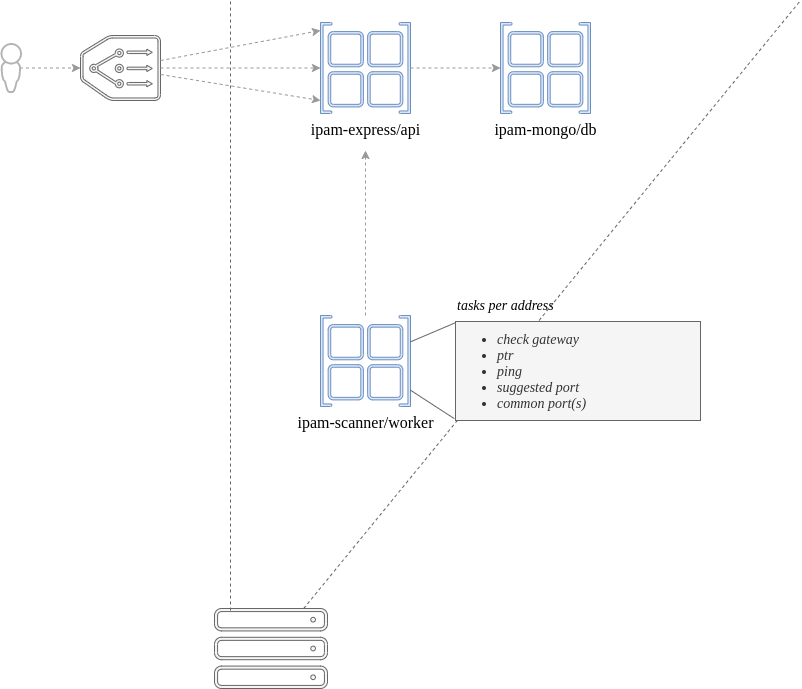
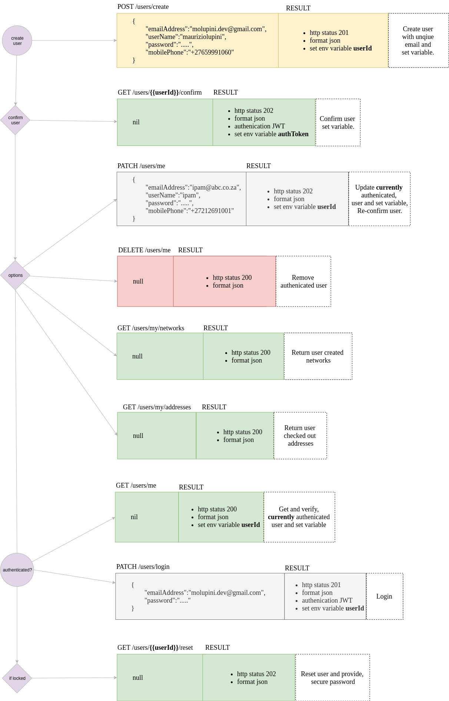
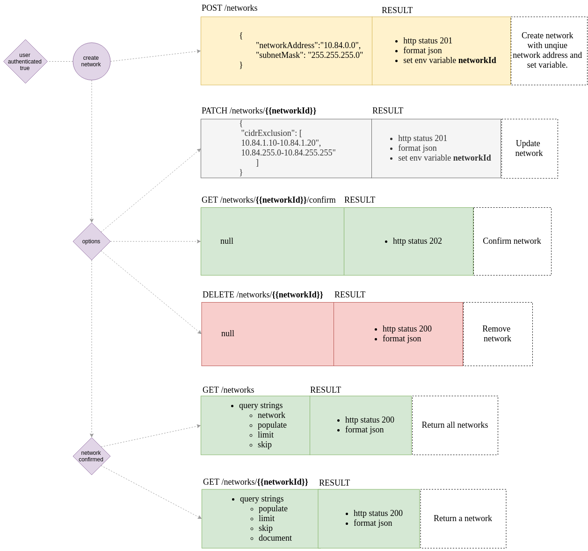
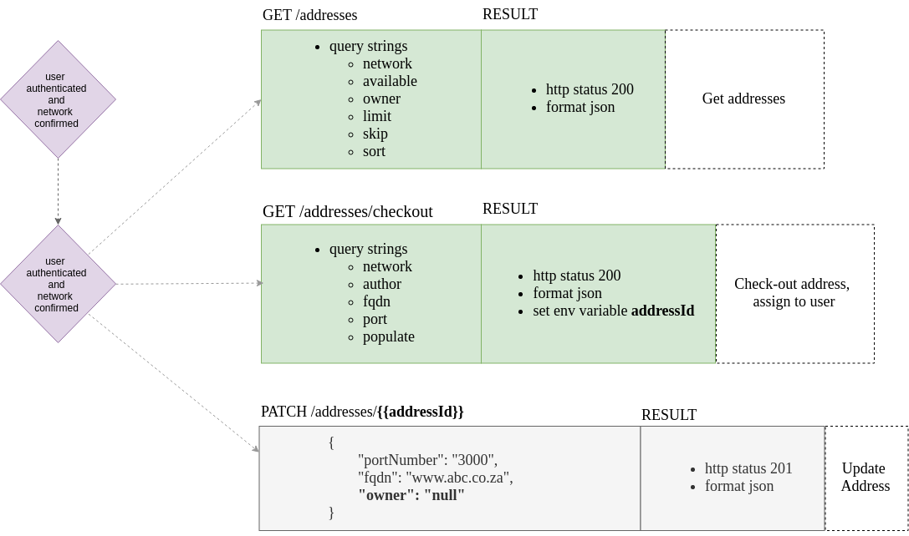

# True-Ip

Is a network address management service.
Powered by Nodejs and Mongodb.

  - Deploy with docker-compose 
  - Important postman.json
  - Create a root user
  - Create a network
  - Add scanner JWT token


# Features

  - IP Address Management 
  
You can:
  - Automated IP address tracking
  - API support for CRUD operations
  

# Tech

get-ip uses a number of open source projects to work properly:

* [node.js] - open-source, JavaScript runtime environment 
* [express] - node.js web framework
* [mongodb] - document-oriented database program

# Installation

#### Install

get-ip requires [Node.js](https://nodejs.org/) v7+ to run.
Open your favorite Terminal and run these commands.

First:
```sh
$ mkdir ./ipam
```
Second:
```sh
$ git init
```
Third:
```sh
$ git clone git@gitlab.com:bcx-sanlam-group/ipam.git
```


#### Author

Using node + nodemon + docker for fast developing. Making any change in your source file will update immediately.

Before we begin, required environment variables:
```sh
$ vi ./.env/app.development.env

# # Express
NODE_ENV=development
JSON_WEB_TOKEN_SECRET=
SEND_GRID_API_KEY=
MONGODB_USER=
MONGODB_PASS_FILE=
MONGODB_URL=

# # Mongo
MONGO_INITDB_ROOT_USERNAME=
MONGO_INITDB_ROOT_PASSWORD=
MONGO_INITDB_DATABASE=

# # Scanner
NETWORK_ADDRESS=all
# or specific networkAddress
NODE_ENV=development
EXPRESS_URL=
JWT_SCANNER=
```


#### Deploy

Easily done in a Docker container.

#### Services

[](SERVICES.png)

Make required changes within Dockerfile + compose files if necessary. When ready, simply use docker-compose to build your environment.
This will create the ipam-express, ipam-mongo and ipam-scanner services with necessary dependencies.
Once done, simply import postman.json into Postman:

For dev, docker compose:
```sh
$ docker-compose up
```

Verify the deployment by navigating to your server address in your preferred browser. Below is a simple health check. 


```sh
$ curl http://localhost:3000/healthv
```

For prod, generate docker builds:
```sh
$ docker build -f mongo.Dockerfile -t mauriziolupini/ipam-mongo:prod .
$ docker build -f express.Dockerfile -t mauriziolupini/ipam-express:prod .
$ docker build -f scanner.Dockerfile -t mauriziolupini/ipam-scanner:prod .
```

Commit prod, push docker builds:
```sh

$ docker push mauriziolupini/ipam-mongo:prod
$ docker push mauriziolupini/ipam-express:prod
$ docker push mauriziolupini/ipam-scanner:prod
```

Get prod, pull docker builds:
```sh
$ docker pull mauriziolupini/ipam-mongo:prod
$ docker pull mauriziolupini/ipam-express:prod
$ docker pull mauriziolupini/ipam-scanner:prod
```

Run prod, either docker run:
```sh
docker network create --driver bridge ipam_network
docker run -d --net=ipam_network --name ipam-mongo --hostname ipam-mongo -e "MONGO_INITDB_ROOT_USERNAME=" -e "MONGO_INITDB_ROOT_PASSWORD=" -e "MONGO_INITDB_DATABASE=" -p 37017:27017 mauriziolupini/ipam-mongo:prod
docker run -d --net=ipam_network --name ipam-express --hostname ipam-express -e "NODE_ENV=" -e "JSON_WEB_TOKEN_SECRET=" -e "SEND_GRID_API_KEY=" -e "MONGODB_USER=" -e "MONGODB_PASS=" -e "MONGODB_URL=" -p 3000:3000 mauriziolupini/ipam-express:prod
docker run -d --net=ipam_network --name ipam-scanner --hostname ipam-scanner -e "JWT_SCANNER=" -e "EXPRESS_URL=" -e "NODE_ENV=" mauriziolupini/ipam-scanner:prod

```

Run prod, or docker swarm see ipam.yml stack file:
```sh
docker stack deploy -c ipam.yml IPAM
```


#### Kubernetes + Google Cloud

See [KUBERNETES.md] coming soon.

# Operating
Simple API operating instructions. Using [postman], a collaboration platform for API development. Import postman.json. 

Edit environment variable:
```sh
url localhost:3000
```

#### Create User Process

[](API-USER.png)

Create user:
```sh
Body
{
	"emailAddress":"hello@gmail.co.za",
	"userName":"mauriziolupini",
	"password":".....",
	"mobilePhone":"....."
}
POST {{url}}/users/create

GET {{url}}/users/{{userId}}/confirm
```

Confirm user:
```sh
GET {{url}}/users/{{userId}}/confirm
```

#### Create Network Process

[](API-NETWORK.png)

Create network:
```sh
Body
{
	"networkAddress":"10.0.0.0",
	"subnetMask": "255.255.255.0"
}
POST {{url}}/networks
```

Patch network:
```sh
{
 "cidrExclusion": [
		"10.0.0.30-10.0.0.35",
    "10.0.0.254/32"
	]
}
PATCH {{url}}/networks/{{networkId}}
```

Confirm network:
```sh
GET {{url}}/networks/{{networkId}}/confirm
```

#### Get Address Process

[](API-ADDRESS.png)

Check-out Address:
*be sure to seed JWT into scanner before you continue*

```sh
GET {{url}}/addresses/checkout?author={{networkId}}&fqdn=www.gotobed.io&port=888&populate=true
```

# License

MIT

# Future Release

  - DHCP, DNS FUNCTIONALITY 
  - IP ADDRESS ALERTING
  - UI / REQUEST FORM
  - SCANNER, ARP LOOKUP
  - SCANNER, EVALUATE WITH NMAP

# Author
**Want to contribute? Great! See repo [git-repo-url] from [Maurizio Lupini][mo]    -Author, Working at [...][linkIn]**


   [mo]: <https://github.com/molupini>
   [linkIn]: <https://za.linkedin.com/in/mauriziolupini>
   [git-repo-url]: <https://gitlab.com/bcx-sanlam-group/ipam.git>
   [node.js]: <http://nodejs.org>
   [express]: <http://expressjs.com>
   [mongodb]: <https://www.mongodb.com/>
   [postman]: <https://www.getpostman.com/>
